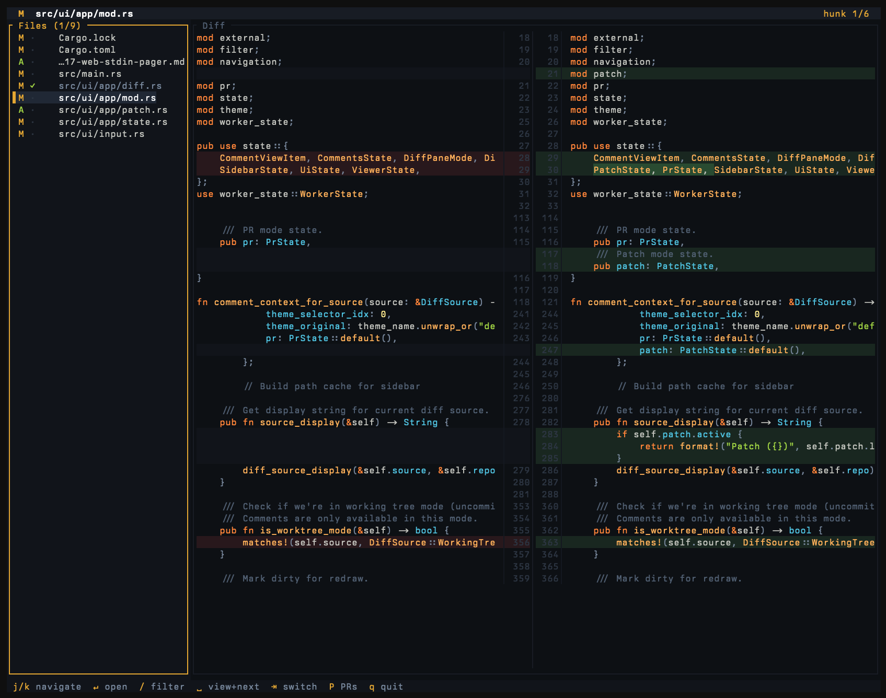

# quickdiff

A fast, keyboard-driven terminal diff viewer for git and jj repositories.



## Install

**macOS / Linux:**
```bash
curl -fsSL https://raw.githubusercontent.com/Yeshwanthyk/quickdiff/main/install.sh | sh
```

**With Cargo:**
```bash
cargo install quickdiff
```

**From source:**
```bash
git clone https://github.com/Yeshwanthyk/quickdiff
cd quickdiff
cargo install --path .
```

## Quick Start

```bash
# View uncommitted changes
quickdiff

# View a specific commit
quickdiff HEAD~1
quickdiff abc123

# Compare two commits
quickdiff main..HEAD
quickdiff @-..@          # jj syntax

# Compare against a branch
quickdiff -b main

# Use as a pager
git diff | quickdiff --stdin
jj diff | quickdiff --stdin

# Generate HTML diff
quickdiff web HEAD~1 --open
```

## Usage

```
quickdiff [OPTIONS] [REV]

Arguments:
  [REV]  Revision or range (e.g., HEAD~3, abc123..def456, @-..@)

Options:
  -c, --commit <COMMIT>  Show changes from a specific commit
  -b, --base <BRANCH>    Compare against merge-base with a branch
  -f, --file <PATH>      Filter to specific file(s)
  -t, --theme <THEME>    Color theme
      --stdin            Read unified diff from stdin
      --pr [NUMBER]      Browse GitHub pull requests
  -h, --help             Print help
  -V, --version          Print version

Subcommands:
  web       Generate standalone HTML diff
  comments  Manage review comments
```

## Navigation

| Key | Action |
|-----|--------|
| `j` / `k` | Navigate files / scroll diff |
| `h` / `l` | Scroll horizontally |
| `Enter` | Open selected file |
| `Space` | Mark viewed and advance |
| `{` / `}` | Jump to prev/next hunk |
| `g` / `G` | Go to start/end |
| `z` | Toggle full file / hunks only |
| `/` | Fuzzy filter files |
| `Tab` | Switch pane focus |
| `[` / `]` | Fullscreen old/new pane |
| `y` | Copy file path |
| `o` | Open in editor |
| `T` | Theme picker |
| `?` | Help |
| `q` | Quit |

## Features

- **Opens at first change** - Jump straight to the first hunk, not the top of file
- **Hunks-only view** - See just the changed sections with context; press `z` to toggle full file
- **Split diff view** - Side-by-side old/new with synchronized scrolling
- **Word-level highlighting** - Inline highlights show exactly what changed within lines
- **Syntax highlighting** - Tree-sitter powered for Rust, TypeScript, Go, Python, and more
- **Sticky headers** - Function/class scope stays pinned while scrolling
- **17 themes** - Press `T` for live preview; set with `--theme`
- **Watch mode** - Auto-refreshes when files change
- **Viewed tracking** - Mark files done with `Space`; state persists across sessions
- **Works with git and jj** - Full support for both, including jj revsets
- **Pager mode** - Pipe any diff: `git diff | quickdiff --stdin`
- **Web export** - Generate standalone HTML: `quickdiff web HEAD~1 --open`

## Themes

Press `T` to open the theme picker, or use `--theme`:

```bash
quickdiff --theme ayu
quickdiff --theme dracula
quickdiff --theme nord
```

Available: ayu, catppuccin, dracula, everforest, github, gruvbox, kanagawa, monokai, nightowl, nord, onedark, palenight, rosepine, solarized, tokyonight, zenburn

Custom themes can be added to `~/.config/quickdiff/themes/`.

## Jujutsu (jj) Support

quickdiff auto-detects jj repositories. All jj revsets work:

```bash
quickdiff @              # Working copy
quickdiff @-             # Parent
quickdiff @-..@          # Working copy changes
quickdiff main..@        # Branch comparison
```

## Development

```bash
cargo fmt --check
cargo clippy --all-targets --all-features -- -D warnings
cargo test
```

## License

MIT
